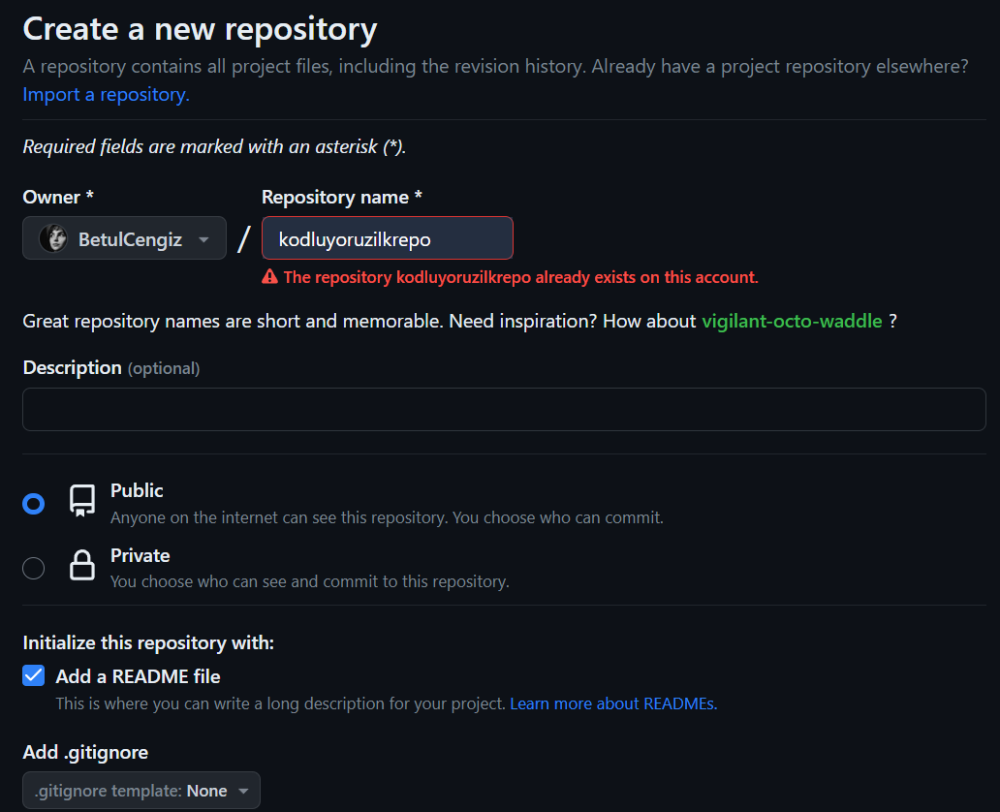

# Kodluyoruz İlk Repo
Kodluyoruz Eğitimi kapsamında açtığım ilk repo
Bu repo Kodluyoruz Front-End Eğitiminde oluşturduğumuz ilk repo. 
İçerisinde bir adet README.md dosyası,bir adet index.html barındırıyor.

# Installation
Öncelikle projeyi clonelayın.
	git clone https://github.com/BetulCengiz/kodluyoruzilkrepo

# Usage
Projeyi cloneladıktan sonra Visual Studio Code programında açınız.
cd kodluyoruzilkrepo
code.
# Contributing 
Pull requestler kabul edilir.Büyük değşiklikler için lütfen önce neyi değiştirmek istedğinizi tartışmak için bir konu açınız.

# License
 MIT
